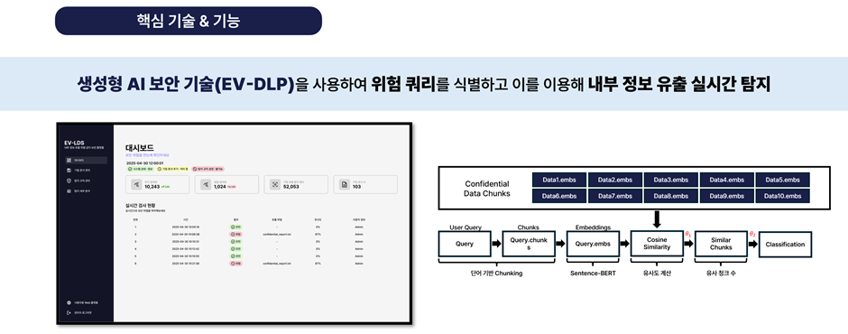
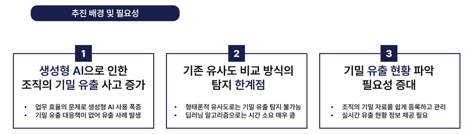
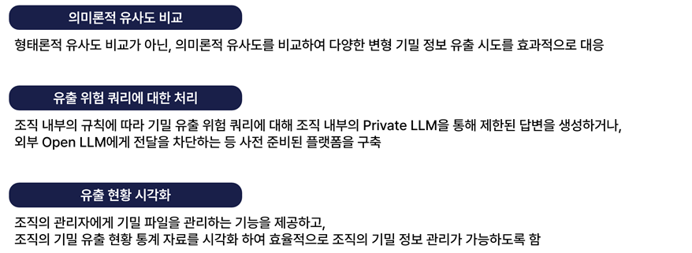
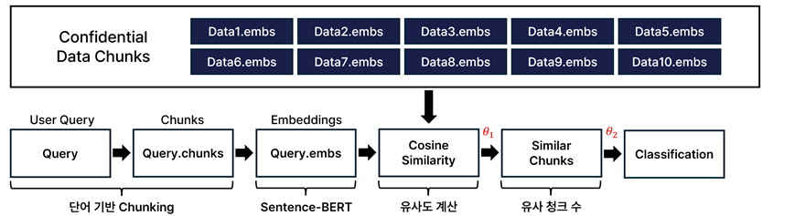
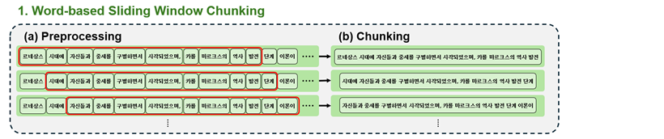
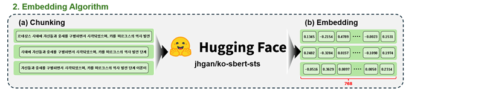
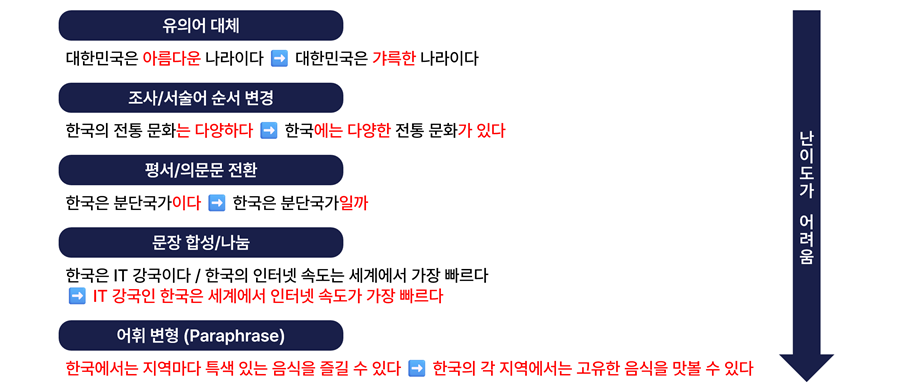
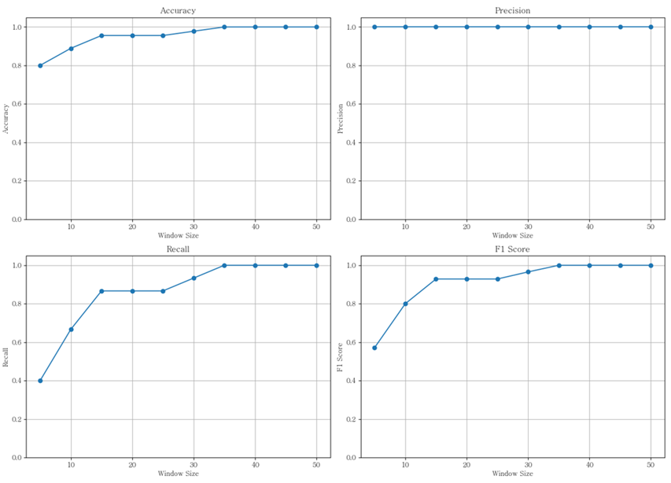
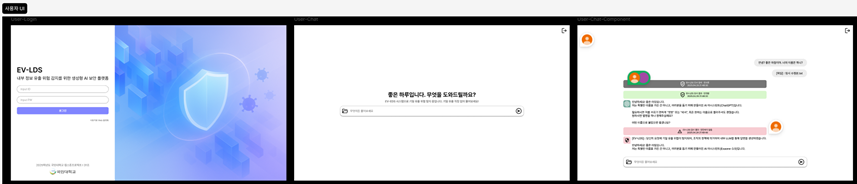
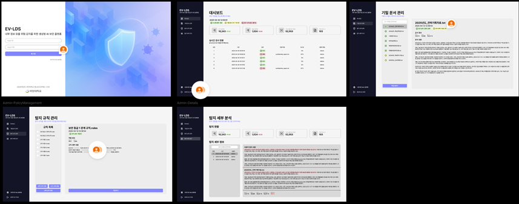

# 🛡️ EV-DLP : 임베딩 벡터 기반 데이터 유출 방지 솔루션

> 🏫 2025학년도 국민대학교 소프트웨어융합대학 다학제간캡스톤디자인  
> 👥 팀 31 **VIGILANT**

## 🔖 목차

### [🙌 프로젝트 소개](#🙌-프로젝트-소개)

### [🧪 연구 배경](#🧪-연구-배경)

### [🔥 프로젝트 목표](#🔥-프로젝트-목표)

### [⚙️ 연구 개발 내용](#⚙️-연구-개발-내용)

### [👥 역할 분담](#👥-역할-분담)

### [📜 참고 문헌](#📜-참고-문헌)

## 🙌 프로젝트 소개

### 🛠️ 사용 기술  

  
  
   
  
  
   
  
  
  

### 🖼️ 홍보 포스터

[🎨 팀-31-포스터](./README-files/poster.pdf)

### 🔖 프로젝트 개요

본 프로젝트는 생성형 AI 기반 보안 기술 **EV-DLP (Embedding Vector-based Data Leakage Prevention) 알고리즘**과 **Web 플랫폼**을 개발한 것입니다. 기존의 키워드 기반 보안 한계를 넘어, 문장의 **의미론적 유사도**를 분석해 기밀 정보 유출을 정밀하게 탐지합니다.

- EV-DLP 알고리즘은 Sentence-BERT[1]를 활용해 문장을 벡터로 변환하고, Vector DB에 저장한 뒤 코사인 유사도를 이용해 유사 문장을 탐색합니다.

- **단순한 키워드 매칭이 아닌, 문맥과 의미를 이해** 하는 방식으로 작동하기 때문에 기존 형태론적 유사도의 한계점을 극복하였습니다.

- **웹 플랫폼**을 통해 사용자는 기밀 문서를 등록하고, 유출 여부를 **시각화된 대시보드**로 확인할 수 있습니다.

- **실시간 탐지 및 위험 분류 기능**도 제공되어, 보안 담당자가 효과적으로 대응할 수 있도록 지원합니다.

이 프로젝트를 통해 **기존 생성형 AI를 통한 기밀 유출 위험을 실질적으로 방어할 수 있는 시스템의 가능성을 제시** 하며, **실제 조직 환경에 적용 가능한 실용성과 확장성을 제공하는 보안 솔루션을 구현** 하였습니다.

## 🧪 연구 배경

최근 **전 산업군에서 생성형 AI(Generative AI)의 도입 및 활용이 폭발적으로 증가** 하고 있습니다.

- 2024년 McKinsey Global Survey on AI에 따르면, 생성형 AI를 실제로 사용하고 잇는 응답자의 비율은 72%에 달하며, 기업 차원에서 해당 기술을 도입한 비율 또한 동일하게 72%로 집계되었습니다.[2] 이는 제조, 금융, 의료, 교육, IT 등 다양한 분야에서 생성형 AI가 업무 자동화, 문서 작성, 코드 생성, 고객 응대 등 여러 측면에서 업무 효율성과 편의성 향상을 이끄는 핵심 기술로 자리매김하고 있음을 시사합니다. 

- 그러나 생성형 AI의 사용 확대와 함께 기밀 유출에 대한 심각한 보안 문제 또한 부각되고 있습니다. 생성형 AI은 사용자가 입력한 질의(Query)나 대화 내용 일부를 모델의 학습 및 품질 개선을 위한 데이터로 활용할 수 있는 구조를 가지고 있습니다. 이로 인해, **조직 내부의 기밀 정보가 외부로 유출되는 사례가 점점 증가** 하고 있습니다. 

- 실제 사례로, 2023년 3월 11일 **삼성전자의 반도체 설비 관련 데이터(계측 정보, 수율, 불량률 등)가 생성형 AI에 입력되면서 기밀 유출이 발생** 하였고, 이에 따라 삼성전자는 내부적으로 생성형 AI 사용을 전면 금지하는 정책을 시행한 바 있습니다. 이와 유사하게, 글로벌 대기업들 또한 내부 보안 가이드라인을 강화하거나, 특정 직무에 대해 생성형 AI 사용을 제한하는 등 임시방편적 대응에 그치는 실정입니다. 하지만 이러한 대응책들은 정보 유출을 사전에 탐지하거나 차단하지 못하는 한계를 지니고 있어, 궁극적인 해결책으로 보기는 어렵습니다. 

- 과거의 정보 유출 방지 시스템으로는 Copykiller와 같이 **형태론적 유사도를 기반으로 하였으나, 이는 사용자 질의 특성상 기밀 문서의 원본이 아닌 단어의 표현 방식이나 문장 구조가 재구성되고 의미 함축, 합성이 일어나는 문제에 대응하기 어렵다는 한계** 가 있습니다. 
- 이를 해결하기 위해 Transformer 모델과 같이 딥러닝 기반 알고리즘을 적용할 수 있지만, 이러한 방식은 **Fine-tuning과 같이 특정 Task에 맞게 학습하는 과정에서 많은 하드웨어 자원과 시간 소모가 이뤄진다는 점과 사용자 질의 검사 시, 시간 소모가 극심하다는 한계점** 을 가지고 있습니다. 

- 기밀 유출 탐지 결과를 **보안 담당자가 직관적으로 확인하고 대응할 수 있는 시스템의 필요성 또한 부각** 되고 있습니다. 조직 차원의 기밀 유출 보안 사고는 막대한 재정 손실과 기술 손실을 초래할 수 있으므로, 유출 통계 정보와 세부 정보를 제공하는 가시적이고 체계적이며 확장 가능한 대응 시스템이 필수적입니다. 

위와 같은 문제점, 한계점을 극복하기 위해 본 프로젝트에서는 생성형 AI에 입력되는 사용자 질의 중 조직의 기밀 정보가 포함되어 있는지를 실시간으로 탐지하는 시스템, EV-DLP 개발과 Web 플랫폼 개발을 목표로 하였습니다. 

## 🔥 프로젝트 목표

내부 정보 유출 위험 감지를 위한 생성형 AI 보안 기술은 아래와 같은 목표를 가집니다.

위의 프로젝트 목표를 이루기 위해 세분화하여 내용을 정리한 결과, 아래와 같습니다.

1. 기밀 문서와 사용자 질의 간 **의미론적 유사도를 기반**으로 기밀 유출 탐지 기술을 개발합니다.

2. **형태론적 유사도의 낮은 정확도의 한계와 딥러닝 기반 유사도 탐지 기술의 자원 소모의 한계를 극복**한 탐지 기술을 개발합니다.

3. **사용자, 관리자 플랫폼을 Web 기반**으로 독립적으로 제공합니다.

4. **기밀 유출 현황을 시각화하고 유사한 부분을 시각적**으로 보여주는 기술을 개발합니다.

5. 사용자가 **설정한 정책에 의거하여 기밀 유출을 탐지하고, 기밀 유출 질의에 대해 처리**합니다.

## ⚙️ 연구 개발 내용

**1. 알고리즘 개발 및 연구 수행 내용**  
본 프로젝트를 수행함에 있어 핵심 부분인 **의미론적 유사도 기반 기밀 유출 탐지 기술**을 개발하였습니다. 아래 그림은 의미론적 유사도 기반 기밀 유출 탐지 기술의 전체 아키텍처를 시각화한 자료입니다.

우선, 사전에 정의된 기밀 문서를 **단어 기반 Chunking 알고리즘**을 통해 Chunk 단위로 분리하였습니다. 단어 기반 Chunking 알고리즘이란, 아래 그림과 같이 원본 문서를 단어 단위로 분리한 다음, Sliding window 방식으로 Chunk를 나누는 알고리즘입니다. 해당 알고리즘을 통해 의미를 더욱 세분화하여 **정확한 탐지 효과를 보장**하였습니다.

세분화된 Chunk에 대해 **Sentence-BERT[1]를 통하여 아래 그림과 같이 고정 길이의 고차원 벡터로 변환**하였습니다. 가변 길이의 Chunk에 대해 의미가 반영된 정해진 차원의 벡터로 변환하여 후술할 의미론적 유사도 비교를 수행하였습니다.

이후에는 Vector Search 알고리즘인 `HNSWlib Vector DB` 를 활용하여 빠른 시간에 높은 정확도로 유사한 Chunk를 탐색할 수 있도록 구성하였습니다. 
이후 성능을 평가하기 위해 **데이터셋을 자체 제작**하였습니다. 원본 데이터셋은 한국어 위키피디아의 랜덤한 주제 문서를 사용하여 제작하였고, 아래 그림과 같이 5단계의 데이터 변형 과정을 거쳐서 변형 데이터셋을 구성하였습니다.

최종 실험 결과는 아래 그림과 같습니다. 앞서 서술한 바와 같이 **5개의 원본 데이터셋과 개별 5개의 변형 데이터셋, 총 30개의 데이터셋에 대해 유사도 비교를 실시**하였습니다. 가로 축은 단어 단위 Chunking 알고리즘에서 Window Size를 의미합니다. 총 4가지 성능 지표로 Accuracy, Precision, Recall, F1-Score을 추출하였으며 모두 Window Size가 35개 이상일 때부터** 1.0을 유지**하는 것을 확인하였습니다.

---

**2. 사용자 플랫폼 개발 내용**  
사용자 플랫폼은 조직 내 사용자가 ChatGPT와 동일하게 **궁금한 점을 질의하고 이에 대한 답변을 확인할 수 있도록 구현**하였습니다.

---

**3. 관리자 플랫폼 개발 내용**  
관리자 플랫폼은 조직 내 관리자가 **기밀 유출 현황을 대시보드로 확인하고, 기밀 문서 관리, 탐지 세부 정보 확인과 같은 다양한 기능을 제공**합니다.

## 👥 역할 분담

| 이름   | 소속           | 역할                       |
| ------ | -------------- | -------------------------- |
| 조항범 | 소프트웨어학부 | 팀장, 유사도 알고리즘 개발 |
| 김민승 | 소프트웨어학부 | 사용자 플랫폼 개발         |
| 박찬민 | 인공지능학부   | Vector DB, 백앤드 개발     |
| 백승렬 | 소프트웨어학부 | 데이터셋 제작, 검증        |
| 심지아 | 소프트웨어학부 | 관리자 플랫폼 개발         |
| 오주엽 | 소프트웨어학부 | 청킹 알고리즘 개발         |

## 📜 참고 문헌

#### [1] Reimers, Nils, and Iryna Gurevych. "Sentence-bert: Sentence embeddings using siamese bert-networks." arXiv preprint arXiv:1908.10084 (2019).

#### [2] The state of AI: How organizations are rewiring to capture value. McKinseu 2025.
